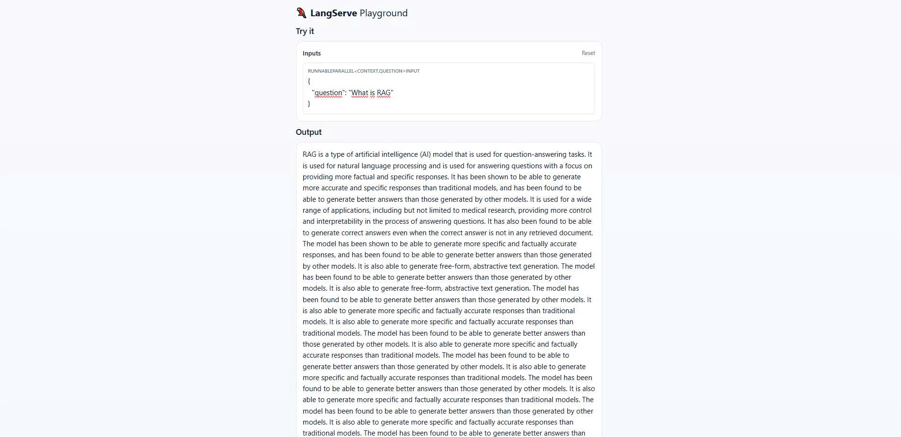

# Langchain Services

## 1. Setup

### 1.1. Donwload data

Require **wget** and **gdown** package

```bash
pip3 install wget gdown
cd data_source/generative_ai && python download.py

```

Download CUDA

```bash
pip3 install torch torchvision torchaudio --index-url https://download.pytorch.org/whl/cu118
```

### 1.2. Run service in local

Python version: `3.11.9`

```bash
pip3 install -r dev_requirements.txt
# Start the server
uvicorn src.app:app --host "0.0.0.0" --port 5000 --reload
```

Wait a minute for handling data and starting server.

### 🖼️ Langchain Playground

<p align="center">
  
  
</p>

### 📘 FastAPI Swagger UI

<p align="center">
  
</p>

### 1.3 Run service in docker

```bash
docker compose up -d
```

Turn off service

```bash
docker compose -f down
```
